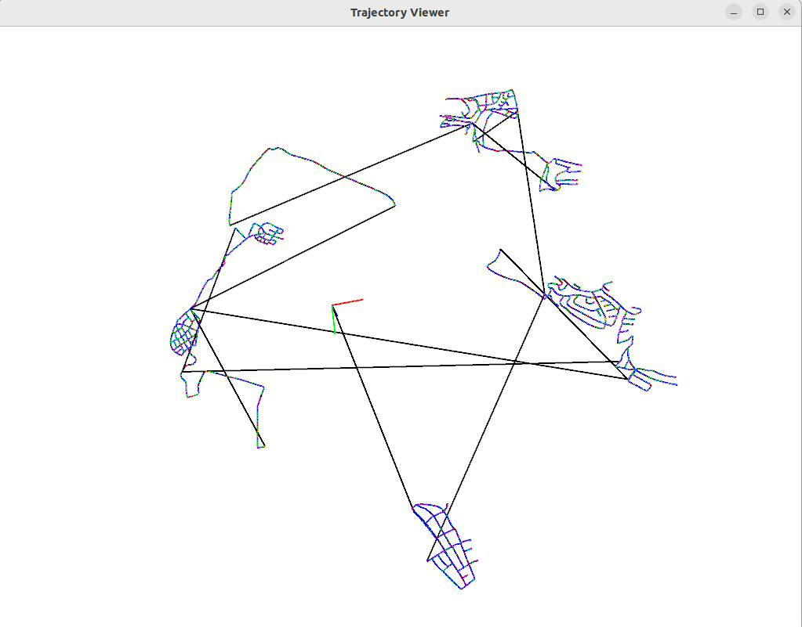

# 3D Position and Rotation Practice 
1. [Eigen basics](https://eigen.tuxfamily.org/dox/) (Eigen matrices and vectors)
2. Rotations (SO(3), Angle-axis, quaternions) - Using Eigen3
3. Visualize 3D coordinates (Pangolin)


## Rotation method
### Euler Angle, SO(3), Axis-Angle, Quaternion
- Euler Angle : Yaw, pitch, roll (Sequence is important)  
- SO(3) : Special Orthogonal Matirx (3D)  
$SO(3) = \{ R \in \mathbb{R}^{3\times3} | R^TR=I, det(R)=1\}$  
- Axis-Angle  
$\mathbb{\theta} = \theta\mathrm{e}$ ($\mathrm{e}$=unit vector)
- Quaternion : add complex number concept  
$q = w +ix+ jy + kz$  
$i^2=j^2=k^2=ijk=-1$  
$ij=k, jk=i, ki=j, ji=-k, kj=-i, ik=-j$  

### SE(3)
Special Euclidean Group (3D): SO(3) + Translation($t_x, t_y, t_z$)  

 

        
## 3D pose viewer
3D coordinate viewer (KITTI dataset pose format = 1camera)

3D coordinates (11501 coordinates)  
= 11501 * SE(3) Matrix  
= 11501 * [index, R11, R12, R13, t14, R21, R22, R23, t24, R31, R32, R33, t34, 0, 0, 0, 1]  


👇 cam0_to_world.txt => SE(3) values 👇

👇 Visualize 👇



### Build 
Pre-requisite: Eigen3, Pangolin v0.6

### Run (Docker)

__Prerequisite:__  Install a "slam:base" docker image from [the main page](https://github.com/HyungJun-Jin/toy_SLAM/tree/main) of this repository
```
# Enable docker port for visualization
xhost +local:docker
# or (Once)
echo "xhost +local:docker" >> ~/.profile 


# Build docker image and Run (X11: GUI port fowarding)
docker-compose up -d
docker attach {container-id}

# Inside docker
cd ./toy_SLAM/3D_Position_Rotation
./build/pose_viewer ./data/cam0_to_world.txt
```

### Run (Local)

```
./build/pose_viewer ./data/cam0_to_world.txt
```