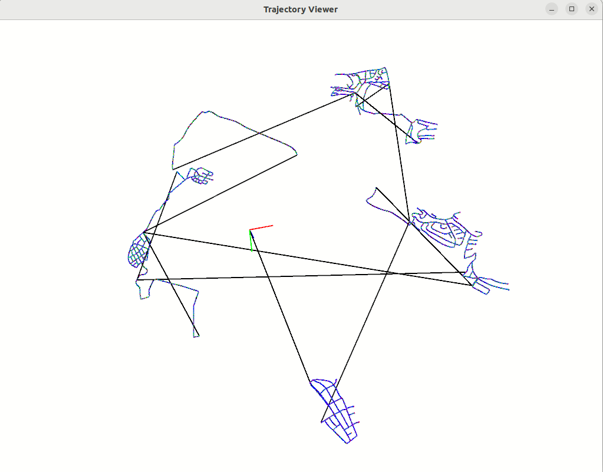

# 3D Position and Rotation Practice 
1. [Eigen basics](https://eigen.tuxfamily.org/dox/){:target="_blank"} (Eigen matrices and vectors)
2. Rotations (SO(3), Angle-axis, quaternions) - Using Eigen3


### 3D pose viewer
3D coordinate viewer (KITTI dataset pose format)




### Build 
Pre-requisite: Eigen3, Pangolin v0.6

### Run (Local)

```
./build/pose_viewer ./cam0_to_world.txt
```


### Run (Docker)

```
# Enable docker port for visualization
xhost +local:docker

# Build and run docker image (X11: GUI port fowarding)
docker build . -t slam:2_2
docker run -it --env DISPLAY=$DISPLAY -v /tmp/.X11-unix/:/tmp/.X11-unix:ro slam:2_2

# Inside docker
cd fastcampus_slam_codes/2_2
./build/pose_viewer ./cam0_to_world.txt
```

